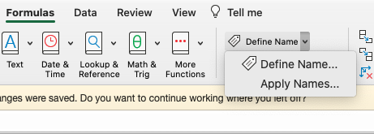
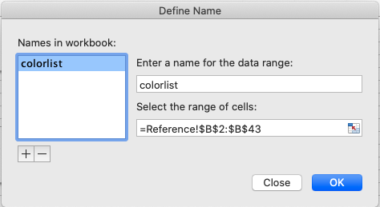

## Color Palette
**Intended Audience**: This document describes how to adjust color definitions in the 
SBAC Global UI Kit and how to apply these changes to the [Reporting Data Warehouse](../README.md) (RDW).

This document is split into two sections. The first covers the steps necessary to alter the color
codes for existing colors and the second covers extra steps that are necessary to change existing
color names, remove existing colors, or add new colors.

### How to edit color codes for existing colors

#### Changes in SBAC Global UI Kit
The colors are defined in the [SBAC Global UI Kit](https://github.com/SmarterApp/SBAC-Global-UI-Kit). 

Most of the color palette is defined in `colors.less`, but `sbac-iab-green`, 
`sbac-iab-red`, `sbac-iab-yellow` are defined in `rdw.less`. Open the correct file, 
find the color definition that needs to be changed, and update its code with the 
desired value. For example, to change the orange color, locate its color definition in
`colors.less`:

```less
...
@purple:                #A5508C;
@orange:                #B15E15;
@cobalt:                #4449BE;
@red:                   #D5124A;
...
```

... and update it with the new color code:
```less
...
@purple:                #A5508C;
@orange:                #FFA500;
@cobalt:                #4449BE;
@red:                   #D5124A;
...
```

Be careful to keep the same syntax. The color name should not change and should be
prefixed with an at sign (@). The color code should be an RGB hex value prefixed with
a pound sign (#) and followed by a semicolon.

If a color name must be changed it will need to be changed here as well. 

The next file to update is `index.html`. This file is for documentation only so it
does not affect the functionality of RDW, but it is useful to keep it synchronized with
the color definitions. Locate the color whose definition need to be changed in the 
html code:

```html
<!-- Reds -->
<div class="col-md-3">
  <div class="panel small">
    <div class="panel-heading">Reds</div>
    ...
    <div class="panel-body orange"><span class="label">.orange</span><span class="hex right">#B15E15</span></div>
    ....
```
... and update the color code text:
```html
<!-- Reds -->
<div class="col-md-3">
  <div class="panel small">
    <div class="panel-heading">Reds</div>
    ...
    <div class="panel-body orange"><span class="label">.orange</span><span class="hex right">#FFA500</span></div>
    ....
```

The last change is to increment the version in `package.json`:

```json
{
  "name": "@sbac/sbac-ui-kit",
  "version": "0.0.33",
  "description": "Common web styling and assets for SBAC projects",
...
```

... should change to: 
```json
{
  "name": "@sbac/sbac-ui-kit",
  "version": "0.0.34",
  "description": "Common web styling and assets for SBAC projects",
  ...
```

The changes can now be pushed out to the git repository, where the definitions will
be automatically built into CSS style files available to RDW. Note that the build 
automatically derives several ancillary color definitions for each base color.
For example, the foreground color used for text appearing on top of the base color is
automatically defined as white or black, whichever gives the better contrast. In 
addition, other colors used for drawing a border for the base color or a contrasting
column header are also generated. There should be no need to modify these generated
color definitions.

#### Changes in RDW_Reporting
   
In `package.json`, which is located in the [RDW Reporting](https://github.com/SmarterApp/RDW_Reporting)
project, in the `webapp` module, locate the `sbac-ui-kit` entry in the dependencies: 
```json
"dependencies": {
  ... 
  "@sbac/sbac-ui-kit": "0.0.33",
  ...
}
```

Adjust this version to match what was created in the SBAC Global UI Kit project:
```json
"dependencies": {
  ... 
  "@sbac/sbac-ui-kit": "0.0.34",
  ...
}
```

When you rebuild the webapp module, the new style definitions will immediately be available
to the entire UI project. However, one more change is necessary to make these definitions
available to the PDF generator that produces the printed reports. The `fragments.html` file
contains a large section of minified CSS styles, which must be updated with the entire contents
of  `sbac-ui-kit-wkhtmltopdf.min.css`, which was updated in the previous section
when the version was incremented and the webapp module rebuilt. Locate the file in the root
of the RDW Reporting project at:
`./webapp/node_modules/@sbac/sbac-ui-kit/dist/css/sbac-ui-kit-wkhtmltopdf.min.css`

... and copy the entire contents of this file. Next, locate `fragments.html` at:
`./report-processor/src/main/resources/templates/fragments.html`

In `fragments.html`, find the previous minified CSS definitions in the `styles-libraries` div:
```html
<div th:fragment="styles-libraries">

    <style>
/*!
 * Bootstrap v3.4.1 (https://getbootstrap.com/)
 * Copyright 2011-2019 Twitter, Inc.
 * Licensed under MIT (https://github.com/twbs/bootstrap/blob/master/LICENSE)
 *//*! normalize.css v3.0.3 | MIT License | github.com/necolas/normalize.css */
.badge,b,dt,kbd kbd,label,optgroup,strong{font-weight:700}.label,audio,canvas,progress,sub,sup,video{vertical-align:baseline}.dropdown .dropdown-toggle .caret,.fa,
...
   </style>
...
</div>
```

Replace the entire contents between `<style>` and `</style>` by pasting in the content
copied from `sbac-ui-kit-wkhtmltopdf.min.css`. 

Finally, rebuild the whole RDW Reporting project. The color definition changes will now be applied
to both the UI and the printed reports. 

#### Changes in Subject Definition Workbook
The Subject Definition Workbook is located in this project, [RDW](https://github.com/SmarterApp/RDW),
in the file `SubjectDef.xlsm` which is under the `tools` folder. The `Reference` tab 
of this worksheet contains a list of colors defined in the SBAC Global UI Kit. 
This list is used only for reference when choosing appropriate colors for new 
subject definitions and does not have any impact on the generated subject files.

To change a color definition, first unprotect the sheet for the `Reference` tab by
right-clicking on the tab and selecting `Unprotect Sheet ...`. Then locate the color
in the list and update its color code. For example, for the color orange:


.... first, update the code:


Next, to update the color swatch, right click its cell, select `Format Cells ...`, then select
`More Colors ...`, and then `RGB Sliders`. In this window, update the `Hex Color` with
the new color code:


Select OK, and the color swatch should be updated:


Finally, protect the `Reference` tab again. If prompted, do *not* change the protection
options for the tab and do not enter a password. Save the worksheet and commit your changes
to the project.

### How to Add, Remove, or Rename Colors

Adding or removing colors or modifying their names requires some extra steps beyond those needed
for modifying color codes of existing colors. It is important to note that renaming or removing colors 
is a dangerous operation. Some of the existing colors are used directly by the RDW UI and any of them
may be used in existing subject definitions. Care must be taken not to modify or delete a color name
that has an existing reference.

#### Changes in SBAC Global UI Kit
As with color code changes, the color definitions in the `colors.less` must be modified. (It is
unlikely that these types of changes would be made to the special colors defined in `rdw.less`.) 
When adding a new, keep in mind that these lists are organized by color family and sorted from
dark to light. For example, to add a new color `orange-bright` to `colors.less`, find a similar
color, like orange:

```less
...
@purple:                #A5508C;
@orange:                #B15E15;
@cobalt:                #4449BE;
@red:                   #D5124A;
...
``` 
... and add in the new definition:
```less
...
@purple:                #A5508C;
@orange:                #B15E15;
@orange-bright:         #FFA500;
@cobalt:                #4449BE;
@red:                   #D5124A;
...
```
Use a hyphen (-) to separate words. Color names are not allowed to contain spaces.

In addition to these changes, the color names list must be updated to reflect the new set
of color names:
```less
// List the colors
@colorVars: blue-dark, ..., purple, orange, cobalt, ...
```
... should be changed to:
```less
// List the colors
@colorVars: blue-dark, ..., purple, orange, orange-bright, cobalt, ...
```
Similar changes would be needed to this list when removing or renaming colors.

After the updates are complete, follow the same instructions in the previous section for changing
color codes to make corresponding changes to `index.html`, increment the version in `package.json`,
and push out the changes.

#### Changes to the XSD Schema
The `RDW_Subject.xsd` file defines the colors that can be used in subject definitions. It contains
the color names, so it does not need to change when only the color codes are changed. However, when
colors are renamed, added, or removed, then the xsd schema must be updated to reflect this.

The file is located in [RDW_Common](https://github.com/SmarterApp/RDW_Common) at
`./model/src/main/resources/RDW_Subject.xsd`. 

Locate the color enumerations in this file and make the necessary adjustments. In the example of
adding an `orange-bright` definition, edit the enumeration:
```xml
<xs:simpleType name="Color">
  <xs:restriction base="xs:string">
    <xs:enumeration value="blue-dark"/>
    ...
    <xs:enumeration value="purple"/>
    <xs:enumeration value="orange"/>
    <xs:enumeration value="cobalt"/>
    ...
  </xs:restriction>
</xs:simpleType>

```
... to add:
```xml
<xs:simpleType name="Color">
  <xs:restriction base="xs:string">
    <xs:enumeration value="blue-dark"/>
    ...
    <xs:enumeration value="purple"/>
    <xs:enumeration value="orange"/>
    <xs:enumeration value="orange-bright"/>
    <xs:enumeration value="cobalt"/>
    ...
  </xs:restriction>
</xs:simpleType>
```
It is recommended to keep the ordering the same as it appears in the SBAC Global UI Kit, but this
is not required.

The `RDW_Common` must then be pushed, merged into the develop branch, and built to get a new version to use
with RDW reports. 

#### Changes in RDW_Reporting
In addition to the changes described in the section about changing color codes, it will be necessary
to increment the common version to bring in the changes to the XSD schema. In `build.gradle`, locate
the section:

```groovy
// Set version dependencies. This allows the cli to force version, e.g. `-Pcommon=1.1.0-SNAPSHOT`
String rdwCommonVersion = project.hasProperty("common") ? project.property("common") : "2.4.0-18"
```
... and adjust the version to match the new version that contains the adjustments to the XSD schema
made in the previous section:
```groovy
// Set version dependencies. This allows the cli to force version, e.g. `-Pcommon=1.1.0-SNAPSHOT`
String rdwCommonVersion = project.hasProperty("common") ? project.property("common") : "2.4.0-19"
```

#### Changes in Subject Definition Workbook
As with changes to the color codes, changes to the `Reference` tab of `SubjectDef.xlsm` will
be necessary. In addition, if the total number of colors changes because of additions or removals,
then the color definition range must be updated. 

Follow the steps in the color code modification section to unprotect the `Reference` sheet and
alter the color definitions as needed. If the total number of colors has changed,
go to `Formulas` in the main menu bar and select `Define Names` from the ribbon:



Select `colorlist` and define the range so it includes the full set of defined colors:



Follow the same procedure described above to protect the `Reference` sheet and push out the changes.
